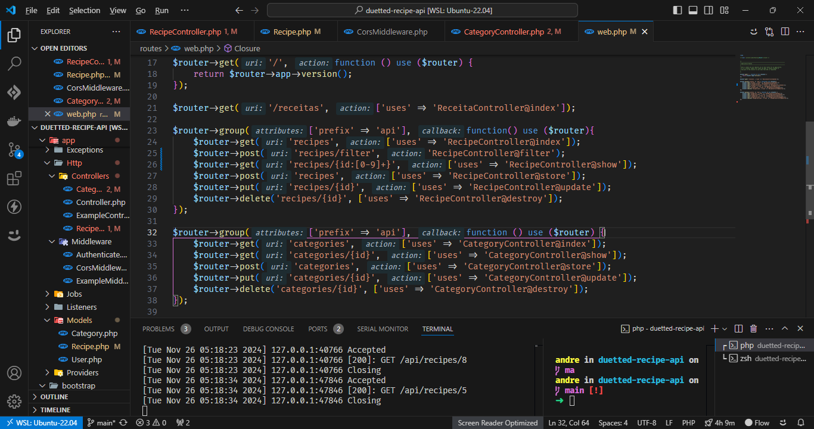
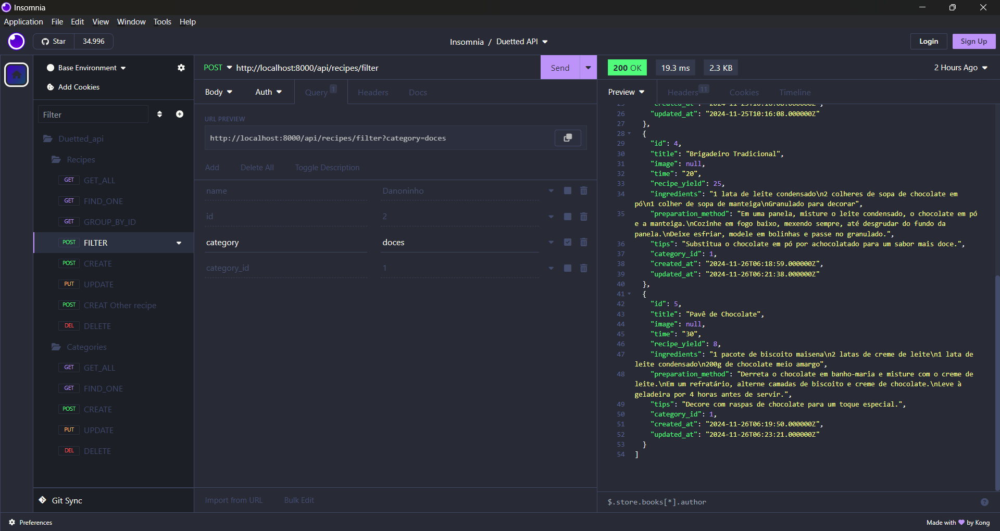

# Duetted

[Link site](https://duetted.vercel.app/ "Duetted - Receitas")

[Link do Design](https://www.figma.com/design/ggteFqrYQ3gpwIWzjyDkmu/Untitled?node-id=0-1&t=6XyL1zDeptUCetSA-1 "Protótipo Figma")

No back-end foi utilizado Laravel Lumen, para o banco de dados foi utilizado Postgres com Docker, e para o deploy foi utilizado o Vercel.

# API
E para testar a API foi utilizado o Insomnia.

Para parte de estilização foi utilizado Framework TailwindCSS e o Shadcn-UI para componentes, assumindo o conceito de Design System.

## Dashboard

Aqui foi criado um dashboard para o administrador, onde ele pode cadastrar, editar, excluir e visualizar os dados dos cadastrados, receitas e categorias.

## Firt Mobile

Foi desenvolvido a primeira versão mobile, onde o usuário pode visualizar as receitas cadastradas, e também pode fazer o login e cadastro.
Melhorando a experiência do usuário em layout responsivo.

## Navegabilidade

A aplicação foi desenvolvida com foco em navegação intuitiva e fácil acesso a todas as funcionalidades.

## Viisualização de Receitas
